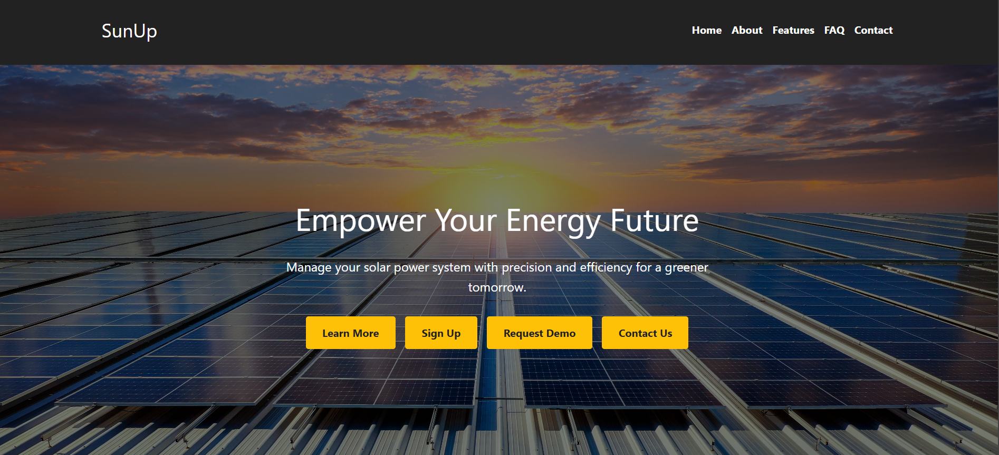
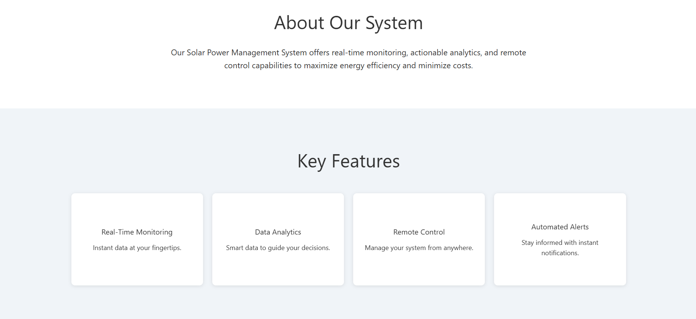
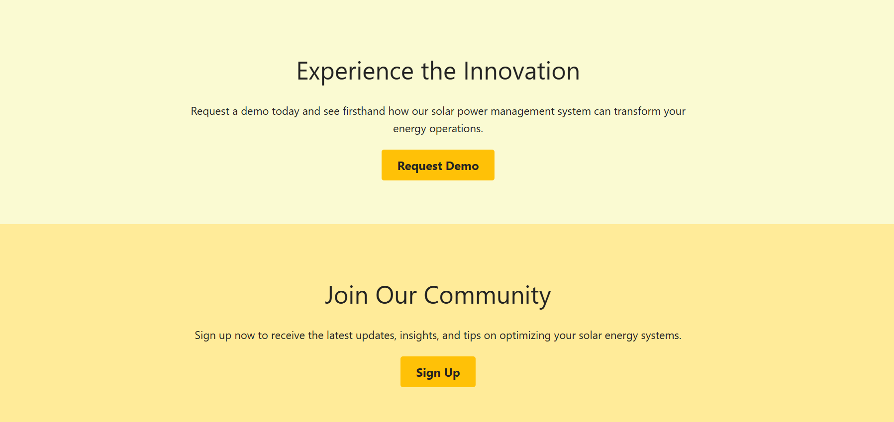
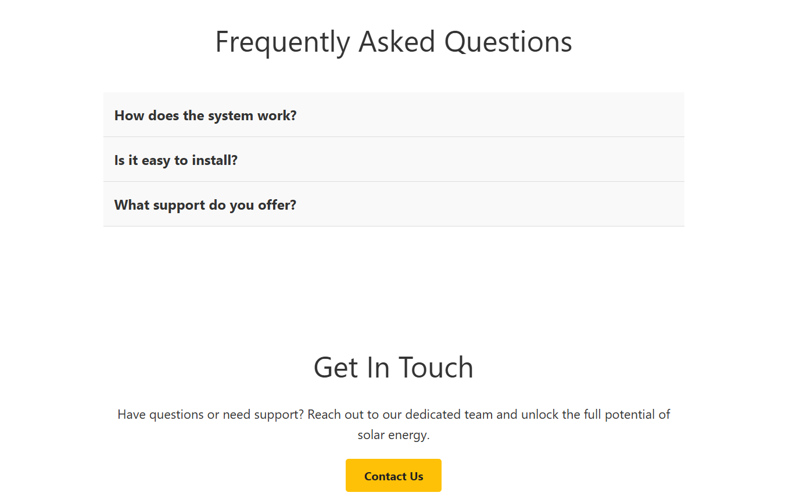
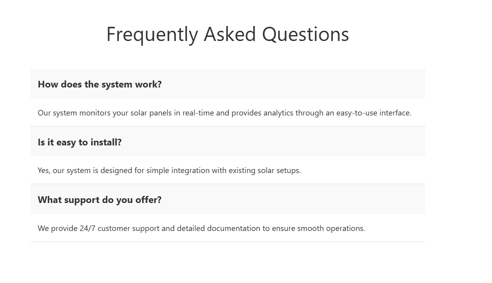

# Solar Power Management Landing Page

For this laboratory I have decided to design a landing page for my IoT Project which is a Solar Power Management system.

## Overview

The landing page is structured into several key sections:

- **Hero Section:** Captures users’ attention with a strong headline and calls-to-action that encourage learning more, signing up, or requesting a demo.

- **About Section:** Provides a short description of the system, highlighting its role in maximizing energy efficiency and reducing costs.
- **Features Section:** Showcases key functionalities through interactive cards that flip to reveal additional details, such as real-time monitoring, actionable insights, remote control capabilities, and automated alerts.

- **Demo & Sign Up Sections:** Invite users to engage further by experiencing a demo or joining the community to receive updates and tips.

- **FAQ Section:** Answers common questions regarding the system’s operation, installation ease, and support services.
- **Contact Section:** Offers a straightforward way for users to get in touch for further assistance or inquiries.

- **Footer:** Contains links including privacy policy and terms of service.

## Link to live demo

[Live Demo](tum-web-lab2-coral.vercel.app)

